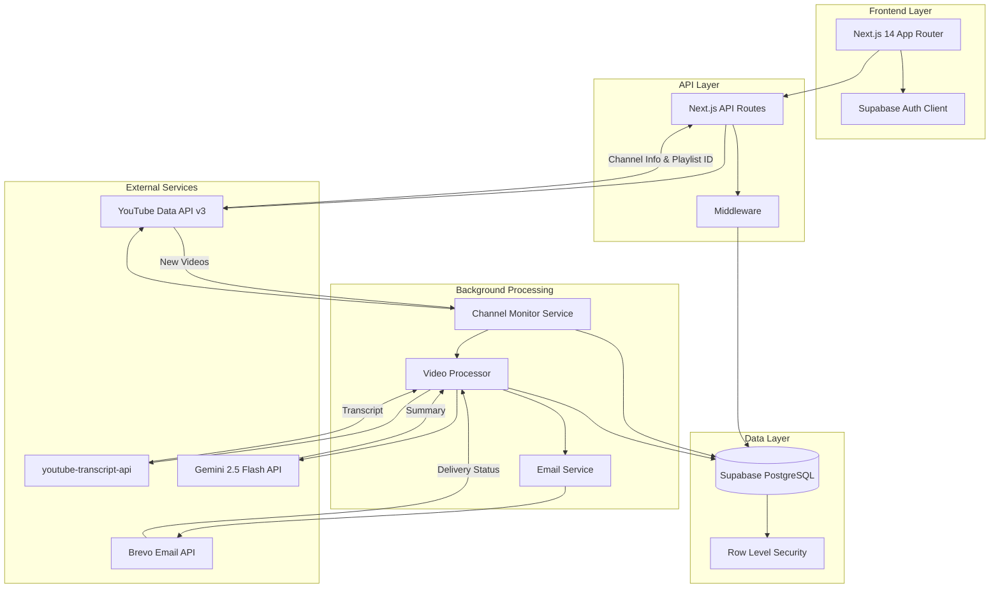
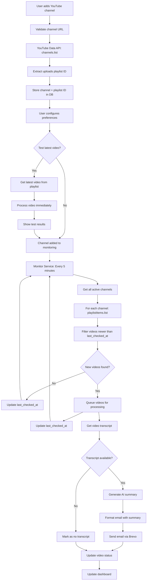

# Design Document

## Overview

Scribesent is a full-stack Next.js 14 application that automatically monitors YouTube channels, transcribes videos, generates AI summaries, and delivers them via email. The system uses a modern tech stack with Supabase for authentication and database, external APIs for content processing, and a background job system for automated monitoring.

The architecture follows a serverless approach with Next.js API routes handling business logic, Supabase providing authentication and data persistence, and external services for specialized tasks like transcription and email delivery.

## Architecture

### High-Level Architecture



### Data Flow

#### User Management Flow
1. **Authentication**: Google OAuth via Supabase Auth
2. **Channel Addition**: User provides YouTube channel URL → API validates via YouTube Data API v3 → Extracts uploads playlist ID → Stores in database
3. **Channel Configuration**: User sets summary preferences (format, style, email recipient)

#### Background Monitoring Flow
1. **Continuous Monitoring**: Background service polls YouTube Data API v3 every 5 minutes
2. **Channel Monitoring**: For each active channel, query `playlistItems.list` using stored uploads playlist ID
3. **New Video Detection**: Compare video publish dates against `last_checked_at` timestamp
4. **Video Processing Queue**: New videos are queued for processing

#### Content Processing Pipeline
1. **Transcript Extraction**: Use youtube-transcript-api to get video transcript
2. **AI Summarization**: Send transcript to Gemini 2.5 Flash with user's format/style preferences
3. **Email Generation**: Format summary into HTML email template
4. **Email Delivery**: Send via Brevo API to user's configured email address
5. **Status Updates**: Update database with processing status and timestamps

#### User Interface Updates
- Real-time dashboard updates via Supabase realtime subscriptions
- Processing status indicators for videos
- Email delivery confirmations

### Channel Monitoring Approach

The system uses YouTube Data API v3 for efficient channel monitoring:

1. **Channel Registration**: When a user adds a channel, use `channels.list` to get the channel's uploads playlist ID
2. **Continuous Polling**: Background service polls every 5 minutes using `playlistItems.list` to check for new videos in each channel's uploads playlist
3. **New Video Detection**: Compare video publish dates against the last check timestamp stored in the database
4. **Quota Optimization**: Playlist monitoring uses only 1 quota unit per channel vs 100 units for search-based monitoring
5. **Service Architecture**: Self-contained monitoring service that runs independently of web requests

### Background Monitoring Service

The monitoring service runs as a separate process that continuously polls YouTube Data API v3:

```typescript
interface MonitoringService {
  startMonitoring(): void
  stopMonitoring(): void
  pollChannels(): Promise<void>
  processNewVideos(videos: VideoInfo[]): Promise<void>
}

class ChannelMonitor implements MonitoringService {
  private intervalId: NodeJS.Timeout | null = null
  private readonly POLL_INTERVAL = 5 * 60 * 1000 // 5 minutes
  
  startMonitoring() {
    this.intervalId = setInterval(() => {
      this.pollChannels().catch(console.error)
    }, this.POLL_INTERVAL)
  }
  
  async pollChannels() {
    const channels = await this.getActiveChannels()
    for (const channel of channels) {
      const newVideos = await this.checkForNewVideos(channel)
      if (newVideos.length > 0) {
        await this.processNewVideos(newVideos)
      }
    }
  }
}
```

**Deployment Options**:
- **Option 1**: Separate Node.js service deployed alongside Next.js app
- **Option 2**: Background worker process within Next.js application
- **Option 3**: Serverless function with external scheduling (e.g., GitHub Actions, external cron)

### Detailed System Flow



## Components and Interfaces

### Frontend Components

#### Authentication Components
- **LoginPage**: Google OAuth integration with Supabase
- **AuthProvider**: Context provider for user state management
- **ProtectedRoute**: HOC for route protection

#### Dashboard Components
- **DashboardLayout**: Main layout with navigation and user menu
- **ChannelList**: Display tracked channels with status indicators
- **VideoHistory**: Paginated list of processed videos with search/filter
- **QuickStats**: Overview cards showing key metrics
- **TranscriptViewer**: Full transcript display with video metadata

#### Channel Management Components
- **AddChannelForm**: Multi-step form for channel configuration
- **EditChannelForm**: Update existing channel preferences
- **ChannelCard**: Individual channel display with actions
- **TestVideoButton**: Immediate processing trigger for latest video

#### Settings Components
- **AccountSettings**: Profile and account management
- **EmailSettings**: Email preferences configuration

### Backend API Routes

#### Authentication Routes
- `POST /api/auth/callback`: Handle OAuth callback
- `POST /api/auth/signout`: User logout

#### Channel Management Routes
- `GET /api/channels`: List user's channels
- `POST /api/channels`: Add new channel
- `PUT /api/channels/[id]`: Update channel preferences
- `DELETE /api/channels/[id]`: Remove channel
- `POST /api/channels/[id]/test`: Test latest video processing

#### Video Processing Routes
- `POST /api/videos/process`: Process individual video
- `GET /api/videos`: List processed videos with pagination
- `GET /api/videos/[id]`: Get video details and transcript

#### Background Service Routes
- `POST /api/monitor/poll-channels`: Internal monitoring service endpoint
- `POST /api/jobs/process-video`: Queue video processing
- `GET /api/monitor/status`: Monitor service health check

#### User Management Routes
- `GET /api/user/profile`: Get user profile
- `PUT /api/user/settings`: Update user settings
- `DELETE /api/user/account`: Delete user account

### External Service Integrations

#### YouTube Data API v3 Integration
```typescript
interface YouTubeService {
  validateChannel(channelUrl: string): Promise<ChannelInfo>
  getChannelUploadsPlaylistId(channelId: string): Promise<string>
  getNewVideosFromPlaylist(playlistId: string, since: Date): Promise<VideoInfo[]>
  searchChannelVideos(channelId: string, publishedAfter: Date): Promise<VideoInfo[]>
  getVideoDetails(videoId: string): Promise<VideoDetails>
}
```

**Channel Monitoring Strategy**:
- Use `channels.list` method to get channel details and uploads playlist ID (1 unit per request)
- Use `playlistItems.list` to get recent videos from uploads playlist (1 unit per request)
- Alternative: Use `search.list` with `channelId` and `publishedAfter` filters (100 units per request)
- Prefer playlist approach for better quota efficiency

**Rate Limiting Strategy**:
- Default quota: 10,000 units/day
- Channel validation: 1 unit per request
- Playlist items listing: 1 unit per request (preferred method)
- Video search: 100 units per request (fallback method)
- Implement exponential backoff for rate limit errors
- Cache channel metadata and playlist IDs to reduce API calls

#### Transcript Service Integration
```typescript
interface TranscriptService {
  getTranscript(videoId: string): Promise<TranscriptData | null>
  isTranscriptAvailable(videoId: string): Promise<boolean>
}
```

**Error Handling**:
- Handle videos without transcripts gracefully
- Support multiple languages automatically
- Implement retry logic for temporary failures
- Store transcript unavailable status to avoid repeated attempts

#### Gemini AI Integration
```typescript
interface AIService {
  generateSummary(
    transcript: string, 
    preferences: SummaryPreferences
  ): Promise<Summary>
}

interface SummaryPreferences {
  format: 'standard' | 'detailed' | 'executive'
  style: 'professional' | 'conversational' | 'academic' | 'bullet-points'
  maxLength?: number
}
```

**Rate Limiting & Cost Management**:
- Free tier: 15 RPM, 1,500 requests/day
- Paid tier: 2,000 RPM for Flash model
- Implement request queuing for high volume
- Use context caching for repeated prompts
- Monitor token usage and costs

#### Email Service Integration
```typescript
interface EmailService {
  sendSummaryEmail(
    recipient: string,
    summary: Summary,
    videoInfo: VideoInfo
  ): Promise<EmailResult>
  
  sendTestEmail(
    recipient: string,
    testData: TestData
  ): Promise<EmailResult>
}
```

**Delivery Optimization**:
- Use Brevo's transactional email API
- Implement email templates with HTML/text versions
- Track delivery status and bounce handling
- Queue emails for batch processing during high volume

## Data Models

### Database Schema

#### Users Table
```sql
CREATE TABLE users (
  id UUID PRIMARY KEY DEFAULT gen_random_uuid(),
  email VARCHAR(255) UNIQUE NOT NULL,
  google_id VARCHAR(255) UNIQUE NOT NULL,
  display_name VARCHAR(255),
  avatar_url TEXT,
  primary_email VARCHAR(255) NOT NULL,
  created_at TIMESTAMP WITH TIME ZONE DEFAULT NOW(),
  updated_at TIMESTAMP WITH TIME ZONE DEFAULT NOW()
);
```

#### Channels Table
```sql
CREATE TABLE channels (
  id UUID PRIMARY KEY DEFAULT gen_random_uuid(),
  user_id UUID REFERENCES users(id) ON DELETE CASCADE,
  youtube_channel_id VARCHAR(255) NOT NULL,
  channel_name VARCHAR(255) NOT NULL,
  channel_url TEXT NOT NULL,
  uploads_playlist_id VARCHAR(255) NOT NULL,
  avatar_url TEXT,
  summary_format VARCHAR(50) DEFAULT 'standard',
  summary_style VARCHAR(50) DEFAULT 'professional',
  email_recipient VARCHAR(255) NOT NULL,
  is_active BOOLEAN DEFAULT true,
  last_checked_at TIMESTAMP WITH TIME ZONE,
  last_video_date TIMESTAMP WITH TIME ZONE,
  created_at TIMESTAMP WITH TIME ZONE DEFAULT NOW(),
  updated_at TIMESTAMP WITH TIME ZONE DEFAULT NOW(),
  UNIQUE(user_id, youtube_channel_id)
);
```

#### Videos Table
```sql
CREATE TABLE videos (
  id UUID PRIMARY KEY DEFAULT gen_random_uuid(),
  channel_id UUID REFERENCES channels(id) ON DELETE CASCADE,
  youtube_video_id VARCHAR(255) UNIQUE NOT NULL,
  title VARCHAR(500) NOT NULL,
  description TEXT,
  thumbnail_url TEXT,
  duration INTEGER, -- in seconds
  published_at TIMESTAMP WITH TIME ZONE NOT NULL,
  transcript_available BOOLEAN DEFAULT false,
  transcript_text TEXT,
  transcript_language VARCHAR(10),
  summary_text TEXT,
  summary_format VARCHAR(50),
  summary_style VARCHAR(50),
  processing_status VARCHAR(50) DEFAULT 'pending',
  email_sent_at TIMESTAMP WITH TIME ZONE,
  error_message TEXT,
  created_at TIMESTAMP WITH TIME ZONE DEFAULT NOW(),
  updated_at TIMESTAMP WITH TIME ZONE DEFAULT NOW()
);
```

#### Processing Jobs Table
```sql
CREATE TABLE processing_jobs (
  id UUID PRIMARY KEY DEFAULT gen_random_uuid(),
  video_id UUID REFERENCES videos(id) ON DELETE CASCADE,
  job_type VARCHAR(50) NOT NULL, -- 'transcript', 'summary', 'email'
  status VARCHAR(50) DEFAULT 'pending',
  attempts INTEGER DEFAULT 0,
  max_attempts INTEGER DEFAULT 3,
  error_message TEXT,
  scheduled_at TIMESTAMP WITH TIME ZONE DEFAULT NOW(),
  started_at TIMESTAMP WITH TIME ZONE,
  completed_at TIMESTAMP WITH TIME ZONE,
  created_at TIMESTAMP WITH TIME ZONE DEFAULT NOW()
);
```

### TypeScript Interfaces

```typescript
interface User {
  id: string
  email: string
  googleId: string
  displayName?: string
  avatarUrl?: string
  primaryEmail: string
  createdAt: Date
  updatedAt: Date
}

interface Channel {
  id: string
  userId: string
  youtubeChannelId: string
  channelName: string
  channelUrl: string
  uploadsPlaylistId: string
  avatarUrl?: string
  summaryFormat: 'standard' | 'detailed' | 'executive'
  summaryStyle: 'professional' | 'conversational' | 'academic' | 'bullet-points'
  emailRecipient: string
  isActive: boolean
  lastCheckedAt?: Date
  lastVideoDate?: Date
  createdAt: Date
  updatedAt: Date
}

interface Video {
  id: string
  channelId: string
  youtubeVideoId: string
  title: string
  description?: string
  thumbnailUrl?: string
  duration?: number
  publishedAt: Date
  transcriptAvailable: boolean
  transcriptText?: string
  transcriptLanguage?: string
  summaryText?: string
  summaryFormat?: string
  summaryStyle?: string
  processingStatus: 'pending' | 'processing' | 'completed' | 'failed'
  emailSentAt?: Date
  errorMessage?: string
  createdAt: Date
  updatedAt: Date
}
```

## Error Handling

### API Error Responses
```typescript
interface APIError {
  error: string
  message: string
  code?: string
  details?: any
}

interface APIResponse<T> {
  success: boolean
  data?: T
  error?: APIError
}
```

### Error Categories and Handling

#### Authentication Errors
- **401 Unauthorized**: Redirect to login
- **403 Forbidden**: Show access denied message
- **Token Expired**: Refresh token automatically

#### External API Errors
- **YouTube API Rate Limit**: Implement exponential backoff, queue requests
- **YouTube API Quota Exceeded**: Show user notification, pause processing
- **Transcript Unavailable**: Mark video as no transcript, continue processing
- **Gemini API Rate Limit**: Queue summary generation, retry with backoff
- **Email API Failure**: Retry with exponential backoff, log for manual review

#### Database Errors
- **Connection Timeout**: Retry with backoff
- **Constraint Violations**: Return user-friendly error messages
- **RLS Policy Violations**: Log security event, return 403

#### Processing Errors
- **Video Processing Timeout**: Mark as failed after 3 attempts
- **Invalid Channel URL**: Validate before saving
- **Duplicate Channel**: Prevent duplicate additions per user

### Retry Strategies

#### Exponential Backoff Implementation
```typescript
async function withRetry<T>(
  operation: () => Promise<T>,
  maxAttempts: number = 3,
  baseDelay: number = 1000
): Promise<T> {
  for (let attempt = 1; attempt <= maxAttempts; attempt++) {
    try {
      return await operation()
    } catch (error) {
      if (attempt === maxAttempts) throw error
      
      const delay = baseDelay * Math.pow(2, attempt - 1)
      await new Promise(resolve => setTimeout(resolve, delay))
    }
  }
  throw new Error('Max attempts exceeded')
}
```

## Testing Strategy

### Unit Testing
- **Components**: React Testing Library for UI components
- **API Routes**: Jest for business logic testing
- **Services**: Mock external APIs for isolated testing
- **Utilities**: Pure function testing with comprehensive edge cases

### Integration Testing
- **API Integration**: Test complete request/response cycles
- **Database Operations**: Test with real Supabase instance
- **External Services**: Test with sandbox/staging APIs where available

### End-to-End Testing
- **User Flows**: Playwright for critical user journeys
- **Authentication**: Test OAuth flow and session management
- **Channel Management**: Test complete channel lifecycle
- **Email Delivery**: Test with email testing service

### Performance Testing
- **Load Testing**: Simulate concurrent users and video processing
- **API Rate Limiting**: Test quota management and backoff strategies
- **Database Performance**: Test query performance with large datasets

### Security Testing
- **Authentication**: Test session management and token handling
- **Authorization**: Test RLS policies and access controls
- **Input Validation**: Test API endpoints with malicious inputs
- **Data Privacy**: Test user data isolation and deletion

### Testing Environment Setup
```typescript
// Test configuration
const testConfig = {
  supabase: {
    url: process.env.TEST_SUPABASE_URL,
    anonKey: process.env.TEST_SUPABASE_ANON_KEY
  },
  youtube: {
    apiKey: process.env.TEST_YOUTUBE_API_KEY
  },
  gemini: {
    apiKey: process.env.TEST_GEMINI_API_KEY
  },
  brevo: {
    apiKey: process.env.TEST_BREVO_API_KEY
  }
}
```

### Continuous Integration
- **GitHub Actions**: Automated testing on pull requests
- **Test Coverage**: Minimum 80% coverage requirement
- **Quality Gates**: ESLint, TypeScript checks, security scanning
- **Preview Deployments**: Vercel preview deployments for testing