# Product Requirements Document - Scribesent

**Version:** 1.1  
**Date:** August 3, 2025  
**Status:** Draft

## Executive Summary

Scribesent is an open-source platform that automatically monitors YouTube channels, transcribes new videos, generates AI-powered summaries, and delivers them via email. Users can self-host the service to track their favorite channels without manually watching every video.

**Vision:** To offer automated video content summary sent directly to your email.

## Problem Statement

- Users want to stay updated with specific YouTube channels but lack time to watch every video
- Manual transcription and summarization is time-consuming and expensive
- No automated solution combines channel monitoring, transcription, summarization, and email delivery in a self-hostable format
- Content professionals need efficient ways to track competitor content and industry updates

## Target Users

**Content Professionals:** Marketing managers, content creators, business professionals tracking industry trends and competitor content.

**Learning Enthusiasts:** Students, professionals pursuing continuous learning, researchers gathering insights from educational video content.

**Busy Executives:** C-level executives, investors, consultants who need to stay informed with extremely limited time.

## Core Features & User Stories

**Channel Management**
- As a user, I can add YouTube channels by URL or channel name
- As a user, I can configure summary preferences for each channel individually
- As a user, I can set different email recipients for different channels
- As a user, I can choose summary format per channel
- As a user, I can test the service on the latest video from a channel immediately after adding it
- As a user, I can view and manage all tracked channels in a dashboard
- As a user, I can edit channel preferences after initial setup
- As a user, I can remove channels from my tracking list

**Email Configuration & Preferences**
- As a user, I can set my primary notification email address (defaults to Google OAuth email)
- As a user, I can enable/disable email notifications per channel

**Content Processing**
- As the system, I automatically detect new videos from tracked channels by polling their YouTube RSS feeds (https://www.youtube.com/feeds/videos.xml?channel_id=CHANNEL_ID)
- As the system, I transcribe videos using youtube-transcript-api 
- As the system, I generate summaries using Gemini API with customizable format
- As the system, I handle videos in multiple languages with high transcription accuracy
- As the system, I store full transcripts for user access and search for 30 days

**Email Delivery & Notifications**
- As a user, I receive email notifications with video summaries at my configured addresses
- As a user, I can choose summary formats (Standard/Detailed/Key Insights)
- As a user, I can access full transcripts via web links in dashboard

- **User Management & Settings**
- As a user, I can create an account with Google OAuth
- As a user, I can access full video transcripts from my dashboard history
- As a user, I can search through my transcript history
- As a user, I can delete my account

## Detailed Requirements

**Email Configuration Features**
- Primary email address management (default: Google OAuth email)

**Transcript & Summary Configuration**

**Core Functionality**
 Monitor up to 10 channels per user using YouTube RSS feed polling (https://www.youtube.com/feeds/videos.xml?channel_id=CHANNEL_ID) at a set interval (e.g., every 5 minutes) with Node.js (axios, xml2js, fs)
 Support videos up to 4 hours in length
 Support multiple languages
 Process videos automatically within 15 minutes of upload
 Smart duplicate detection to avoid processing same video multiple times
 Manual testing capability for latest video on newly added channels
 Automatic background monitoring without user intervention
- Manual testing capability for latest video on newly added channels
- Automatic background monitoring without user intervention

**Performance & Scale**
- Support 100+ concurrent users initially, scaling to 1,000+ users within 12 months
- Process 100+ videos per hour during peak times
- Web dashboard loads within 3 seconds
- 99% system uptime with automatic retry for failed jobs
- 95%+ email delivery rate

**Security & Compliance**
- RLS Policies
- OAuth 2.0 user authentication with Google
- GDPR and CCPA compliance with data deletion

## DESIGN STYLE
NEO BRUTALISM BLUE WHITE COLOR PALLETE USING COMPONENTS FROM https://neobrutalism.dev/ use context7 to get the components needed for the site!

## Pages Structure

**Landing Page** (`/`)
  - Product overview CTA
  - Features highlight 
  - Maqueer text of key features
  - Login/sign up CTA

**Authentication Pages**
- **Login Page** (`/login`)
  - Google OAuth login button
  - Terms of service and privacy policy links

**Main Dashboard Pages**
- **Dashboard Home** (`/dashboard`)
  - Overview of tracked channels
  - Recent video summaries
  - Quick stats (total channels, videos processed, emails sent)

- **Channels Management** (`/channels`)
  - List of all tracked channels
  - Add new channel button
  - **"Test" button** for each channel using latest video
  - Test results display (success/failure, summary preview, email confirmation)
  - Edit/delete channel actions
  - Last check timestamp display

- **Add Channel** (`/channels/add`)
  - YouTube channel URL input
  - Channel validation
  - Summary preferences configuration:
    - Format: - Standard/Detailed/Key Insights
    - Email recipient input  (google email by default)

- **Edit Channel** (`/channels/[id]/edit`)
  - Modify existing channel preferences
  - Same configuration options as add channel

- **Transcript Viewer** (`/transcripts/[videoId]`)
  - Full transcript display and AI summary (format selected by user)
  - Video metadata (title, channel, date)
  - Link back to original YouTube video

- **Account Settings** (`/settings`)
  - Profile information
  - Connected Google account
  - Account deletion
  - Primary email display (from Google OAuth)
  - Edit email preference for summary

**Error Pages**
- **404 Not Found** (`/404`)
- **500 Server Error** (`/500`)

## System Flow

```mermaid
flowchart TD
    A[User visits app] --> B[Login with Google OAuth]
    B --> C[Supabase authenticates user]
    C --> D[Next.js dashboard loads]
  D --> E[User adds YouTube channel URL]
  E --> F[Validate channel via YouTube RSS feed]
  F --> G[User configures channel preferences]
    G --> G1[Choose summary format: Standard/Detailed/Executive]
    G1 --> G2["Choose summary format: Standard/Detailed/Key Insights"]
    G2 --> G3[Choose email address for this channel]
    G3 --> H[Store channel + all preferences in PostgreSQL]
    H --> H1{User clicks 'Test Latest Video'?}
    H1 -->|Yes| H2[Fetch latest video from channel]
    H2 --> H3[Process video immediately with user preferences]
    H3 --> H4[Generate summary and send test email]
    H4 --> H5[Display test results to user]
    H5 --> I[Channel added to monitoring system]
    H1 -->|No| I[Channel added to monitoring system]
    
  %% Background Polling Process
  BG1[Background Service: Every 5 minutes] --> BG2[Poll all tracked channels via YouTube RSS feeds]
  BG2 --> BG3[Parse RSS XML and check for new videos since last check]
  BG3 --> BG4{New videos found?}
  BG4 -->|No| BG1
  BG4 -->|Yes| BG5[Store new video metadata in DB]
  BG5 --> L[Call youtube-transcript-api]
  L --> M{Transcript available?}
  M -->|No| Q[Mark video as transcript unavailable]
  M -->|Yes| R[Store transcript in DB]
  R --> S[Retrieve channel-specific user preferences from DB]
  S --> T[Send transcript to Gemini API with configured format]
  T --> U[Gemini generates summary per user's channel settings]
  U --> W[Send summary email automatically]
  W --> X[Format HTML email with summary]
  X --> Z[Queue email to primary email address in Brevo]
  Z --> BB[Brevo sends email to user]
  BB --> CC[Update video status in PostgreSQL]
  CC --> DD[Update dashboard with new summary]
  Q --> BG1
  DD --> BG1
    
    %% Connect user flow to background process
    I -.-> BG1
```

## Technology Stack

**Frontend & Backend:** Next.js 14 with TypeScript, Tailwind CSS, shadcn/ui  
**Database:** Supabase (PostgreSQL) with Google OAuth  
**APIs:** Gemini API (Gemini 2.5 Flash-Lite) 
**Email:** Brevo API  
**Transcription:** https://www.npmjs.com/package/youtube-transcript 
**Monitoring:** Automated polling of YouTube RSS feeds every 5 minutes using Node.js (axios, xml2js, fs)  
**Hosting:** Vercel (full-stack deployment)
